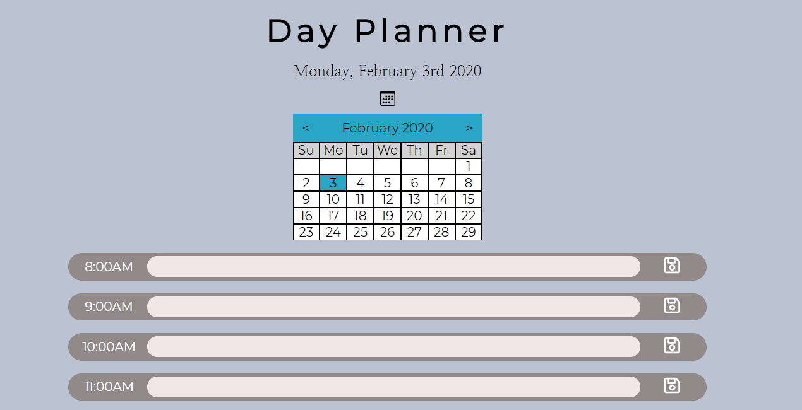

# day-planner
A calendar that displays a user's events for each hour of the day. The app uses jquery and uses Moment.js to deal with Datetimes. 

## usage
The user can pick a date using the calendar and add notes to each hour. The colors change based on whether the hour has passed. Notes are stored in the browser in localstorage and will be loaded when the app starts.

https://wbrink.github.io/day-planner

